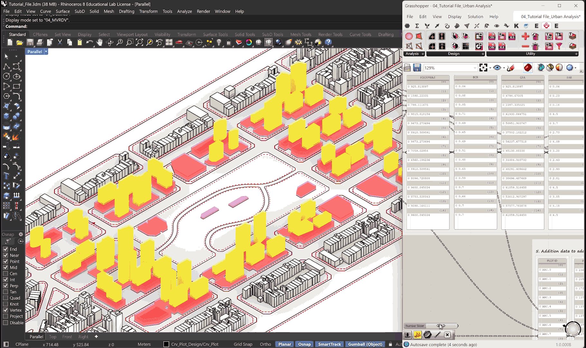

# Orangoplan RH-GH Plug-in 
Information about the OrangoPlan plug-in for Grasshopper (Rhinoceros 3D).

  

Orangoplan provides parametric tools to model, analyze, and visualize complex urban design workflows. It enables designers and planners to create adaptive street networks, land-use layouts, building massing, public space configurations, and infrastructure simulations.

The plugin helps make better decisions by combining spreadsheets, planning rules, and measurable factors to improve city design, livability, and sustainability. This tool is ideal for master planning, zoning studies, and rapid prototyping of urban-scale interventions.

  

After installing the plug-in using the Package Manager or download it from Food4Rhino and restarting Rhino, you'll find the toolbox in Grasshopper toolbar.

