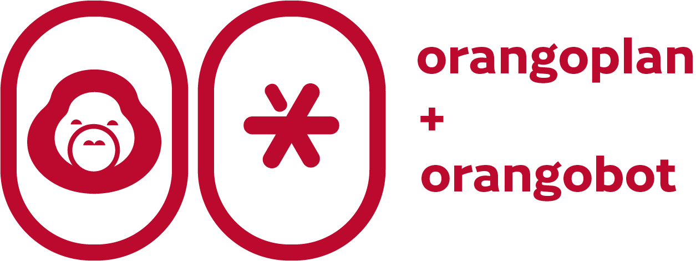

  

 OrangoPlan is developed as a flexible parametric toolkit for urban analysis and design, enabling real-time testing of spatial, network, and performance-driven scenarios. As urban models grow more complex and iterative design becomes essential, OrangoPlan aims to make computational urban tools more accessible, customizable, and integrated within design workflows—supporting designers, planners, and researchers alike.

Developed by Daniel Harianto ©2026