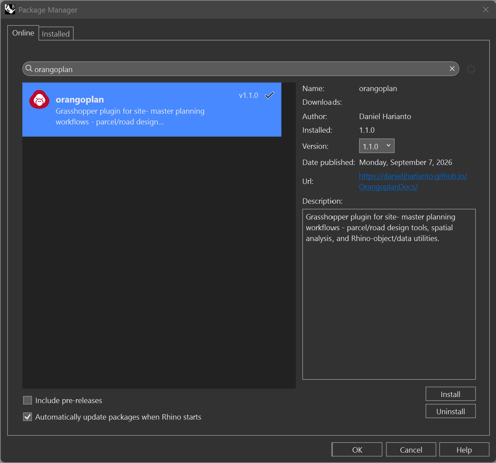

##Installation
OrangoPlan is available through Rhino's Package Manager. In Rhino, run the `_PackageManager` command, search for **orangoplan**, and install. It can also be downloaded from **[Food4Rhino](https://www.food4rhino.com/en/app/orangoplan)**. Restart Rhino after installing to load the plugin.

 

##System Requirements

Operating System: Windows 10 / 11 or macOS

- Software: Rhino 7 or later
- Environment: Grasshopper (included with Rhino)

Hardware:

- Minimum 8 GB RAM (16 GB recommended for large models)
- Multi-core CPU recommended for real-time analysis

Optional:

- CSV-compatible editor for modifying input parameters
- GIS software for data preparation and validation

!!! warning "Work in Progress"
    This project is currently under active development. Features and documentation may be incomplete or subject to change.